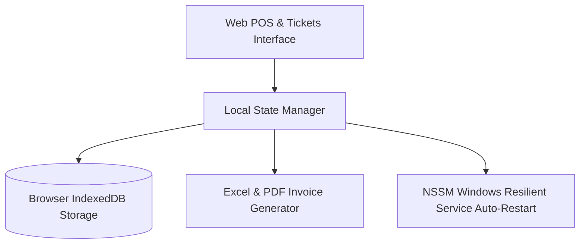

# Local Business CRM, Tickets & Cash Register

---

## 📌 Project Overview

Full-stack offline-first web POS and CRM system designed for commercial businesses (ticketing, cash register, payroll, debt management). Built with 100% browser storage (IndexedDB), Excel export, and deployed in production with a self-resilient Windows NSSM service.

This project is an engineering module built by **DJIDEL Abdelali Rayan** (Systems & Automation Engineer, USTHB).

---

## 🏗️ System Architecture & Data Flow

---

## 🛠️ Key Technologies & Frameworks

- **JavaScript**
- **IndexedDB**
- **NSSM Windows Service**
- **Excel Export**
- **POS System**

---

## 🚀 Live Interactive Web Demo

No installation required! Test and interact with the full web simulation live in your browser:
🔗 **[Launch Interactive Web Demo](https://djidelabdelali.github.io/smart-crm-pos-system/)**

---

## 🔗 Connected Portfolio Ecosystem

- 🌐 **Main Portfolio**: [djidelabdelali.github.io/portfolio](https://djidelabdelali.github.io/portfolio/)
- 💻 **GitHub Profile**: [github.com/DjidelAbdelali](https://github.com/DjidelAbdelali)
- 💼 **LinkedIn Profile**: [DJIDEL Abdelali Rayan](https://linkedin.com/in/djidel-abdelali-rayan-814b25207)

---

  Developed by DJIDEL Abdelali Rayan — Systems & Automation Engineering

